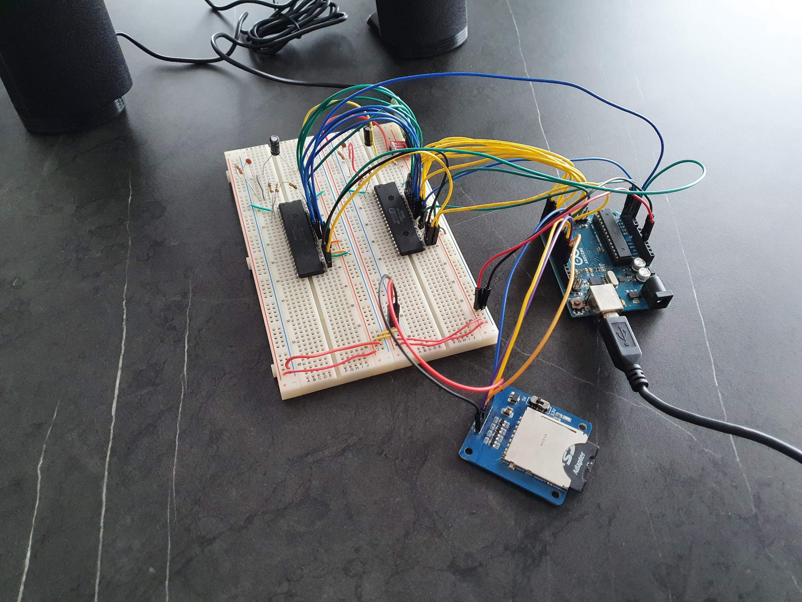
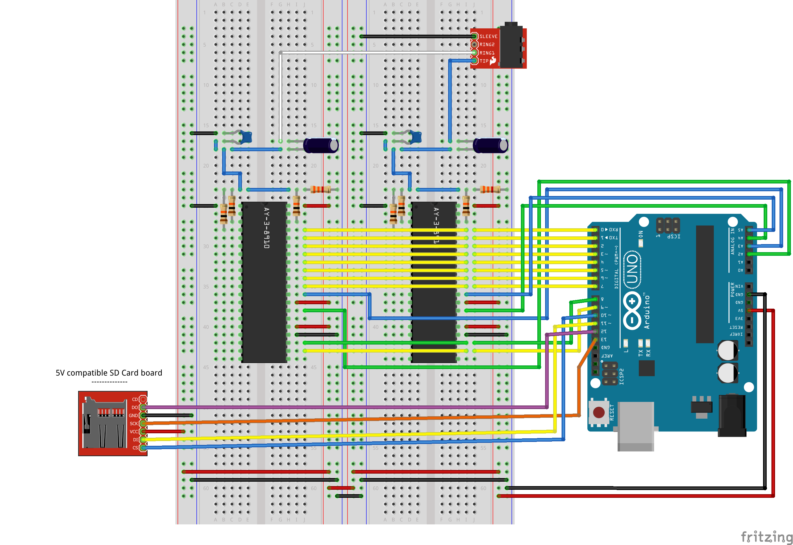

# Using two AY-3-8910 programmable sound generators with an Arduino

This repository holds the source code and schematics for a version of what was shown in the video https://www.youtube.com/watch?v=srmNbi9yQNU but using 2 AY-3-8910 programmable sound generators instead of just one.

## Diagram of the circuit in the breadboard

## Arduino code:

[AY-3-8910-2_test.ino](AY-3-8910-2_test.ino)  
Arduino source code for a test where sounds are played in a channel of each AY-3-8910.

[AY-3-8910-2_sd_card.ino](AY-3-8910-2_sd_card.ino)  
Arduino source code to play songs in a custom file format (SNG) from an SD Card in the two AY-3-81910 PSGs.

*Note: When programming the arduino, it might be necessary to disconnect power to the AY-3-8910 chips as the pins to program the Arduino are also being used to transfer data to the PSGs.
      To do this simply disconnect the 5V connecting the arduino to the breadboards while programming it and then reconnect it and don't forget to reset the Arduino afterwards by pressing the respective button.*

## YM file converter:

[ymConverter2.py](ymConverter2.py)  
Second version of a Python script to convert YM files to the custom file format SNG for the AY-3-8910 PSGs and to be used with the code above for the Arduino.
It can convert one YM file to be played in one AY-3-8910 or two YM files to be played in two AY-3-8910 PSGs.

